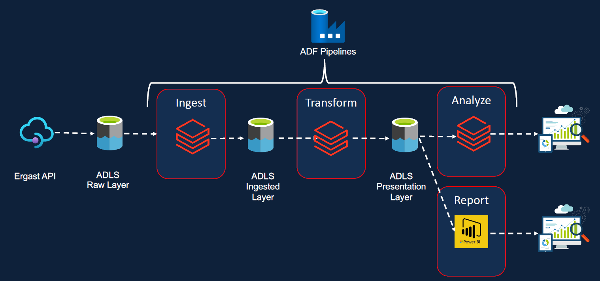
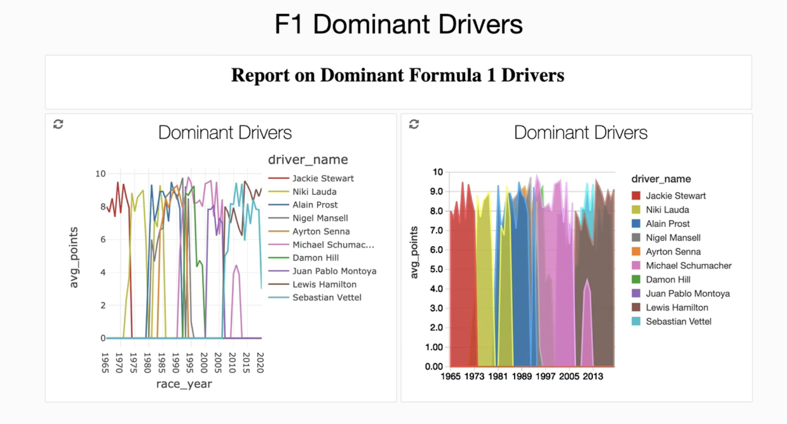
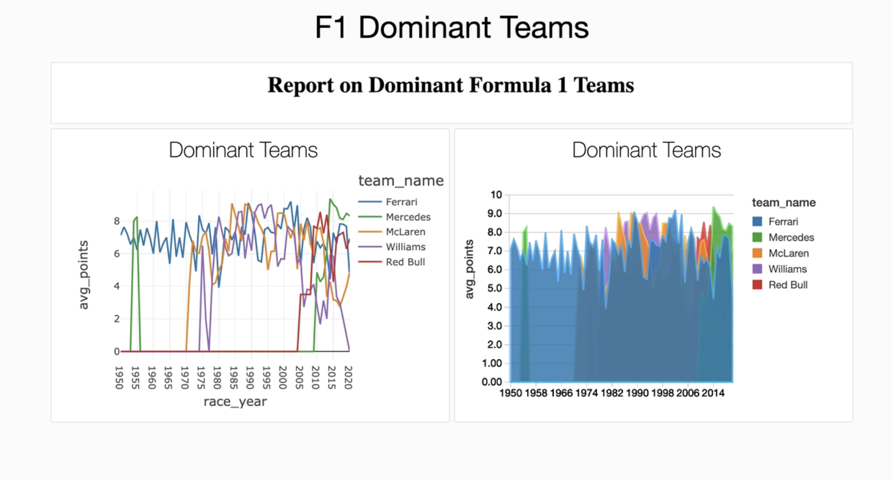

# F1_RaceTour
This repo is used to get started with Azure and Databricks, as well as Spark and so on.
Thanks to Ramesh Retnasamy on Udemy, this guy get me into Azure Data Engineer. Appreciate all the precious knowlegde in the course.
- Disclaimer : all the codes are hosted on Azure Databricks notebook.

## Overview
Leveraging state-of-the-art technologies like Databricks, Azure, and PySpark, this repository houses the code and documentation for a comprehensive Data Pipeline Transformation project. Its objective is to analyze historical Formula 1 race data, ingesting, transforming, and visualizing it to uncover insights into the performance of drivers and teams over decades of racing history.

## Data Pipeline 
- Collect raw F1 Tournament data from public API into Data Lake
- Extract raw data in Data Lake then ingest data apply schema, store ingested data in Parquet format
- Filter the data needed for Analysis and join multiple file of the same structure data using Pyspark on Databricks
- Load transformed data back into the higher layer of the data lake
- Schedule all the process using Data Factory and set it run every night

## Analyze Result

